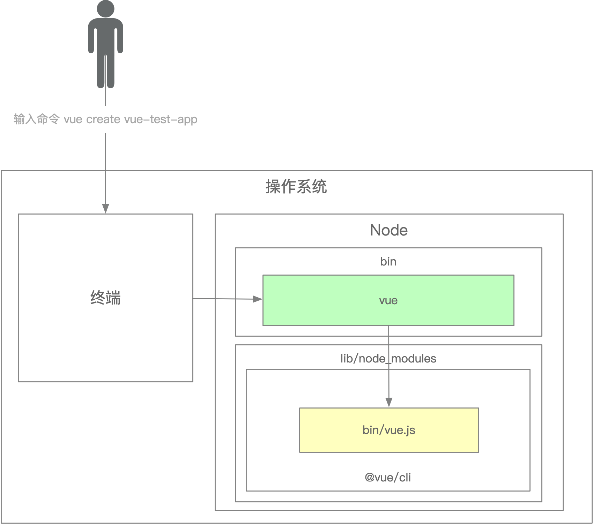

## 一 含义

Q1 什么是脚手架

A:

1 脚手架本质是 1个操作系统的客户端，它通过命令行 执行

```bash
vue create test-app
```

上面这条命令由 3 个部分组成：
  - 主命令: `vue`
  - command: `create`
  - command 的 params: `test-app`
  - 它表示创建一个 vue 项目，项目的名称为 `test-app`


2 有时候需要传入 命令的选项，比如当前目录已经有文件了，我们需要覆盖当前目录下的文件，强制进行安装 `vue` 项目：

```bash
vue create vue-test-app --force
```

这里的 `--force` 叫做 option：
  - 用来辅助脚手架 确认 在特定场景下用户的选择（可以理解为配置）。


3 一般可以通过 `主命令 command --help` 查看一个command 支持的所有选项配置


## 二 脚手架的执行原理

Q1 输入一个命令后，它的完整的 解析流程是什么

A:

以 vue/cli 为例，其完整解析流程是

1 注册 `vue` 命令，并创建 软链接关系

1.1 全局安装 `@vue/cli`
  - 会在  `/usr/local/lib/node_modules` 目录下，下载安装 `@vue/cli` 源代码
  
1.2 由于 `@vue/cli/package.json` 内部里，定义了 `bin` 字段
  - 所以 在会 `/usr/local/bin` 目录下，在全局环境变量$PATH 里注册1个全局 `vue` 命令
  - 全局`vue` 命令，其实是一个软链接，即创建了1个 `vue命令 --> 实际执行文件` 的映射关系

```json
{
  "name": "@vue/cli",
  "version": "4.5.9",
  "description": "Command line interface for rapid Vue.is development",
  "bin": {
    "vue": "bin/vue.js"
  }
}
```

```bash
# 全局 `vue` 命令 注册在 `/usr/local/bin` 目录下
# 实际执行文件 路径是 `/usr/local/lib/node_modules/@vue/cli`
# 所以软链接 相对路径映射是

vue@ -> ../lib/node_modules/@vue/cli/bin/vue.js
```


2 在终端输入 `vue create test-app` 

2.1 终端 解析出 `vue` 命令

2.2 终端 在操作系统的 环境变量 $PATH中，找到 `vue` 命令，相当于执行了 `which vue`

2.3 `which vue` 一般会返回 1个可执行文件
  - 在 Unix-like 系统下：可执行文件会被创建为 软链接，放在 `/usr/local/bin/` 目录下（这个目录在 $PATH 环境变量中）
  - 在windows环境下：可执行文件是一个 .cmd文件，位于 xxx\npm\ 目录下

2.4 由上述1.2内容可知，这个 可执行文件/软链接 会实际指向：
  - 在 Unix-like 系统下： `/usr/local/lib/node_modules/@vue/cli/bin/vue.js`
  - 在 Windows 环境下： `xxx\npm\node_modules\@vue\cli\bin\vue.js`


3.1 由于 `@vue/cli/bin/vue.js` 的头部第一行是 `#!/usr/bin/env node`
  - `/usr/bin/env` 返回的是 所有注册的$PATH 全局变量
  - `/usr/bin/env node` 会 自动唤起 node解释器的 执行
  - 所以 终端会自动通过 `node` 解释器，执行 `@vue/cli/bin/vue.js`

```js
// @vue/cli/bin/vue.js 头部第一行
#!/usr/bin/env node

```

3.2 `vue.js` 解析 command / options

3.3 `vue.js` 执行 command

4 执行完毕，退出执行


其流程图是




## 三 其他问题

Q1 如何为 `node` 脚手架命令， 创建别名

A:
在 `/usr/local/bin` 全局命令目录下，通过 `ln -s` 命令，利用已有全局命令， 创建别名

```bash
## 当前路径是 `/usr/local/bin`

ln -s ./vue my-haha-vue
```


## 四 参考文档

[01-从使用角度理解什么是脚手架](../1.2-cli-docs/1.4-从使用角度理解什么是脚手架.md)

[02-脚手架的实现原理](../1.2-cli-docs/1.5-脚手架的实现原理.md)
